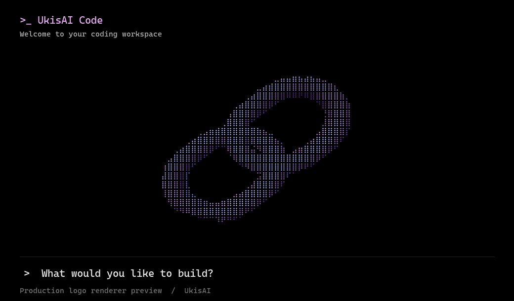

<p align="center"></p>

# Ukis Codex

UkisAI's terminal coding agent, forked from [OpenAI Codex](https://github.com/openai/codex).

This first version brings the UkisAI website's interlocking chain logo and pink / violet / blue palette to the terminal. The welcome screen and empty conversation background share the animated mark, including click-to-replay, fading, reduced-motion handling, and small-terminal layout behavior.

The coding engine, authentication, permissions, configuration, and protocol names remain compatible with upstream Codex. This repository contains the CLI and app-server source; a Ukis desktop interface is outside this first version.



The preview above uses cells from the compiled production logo renderer.

## Build and run

Use the Rust toolchain pinned in `codex-rs/rust-toolchain.toml` and the platform prerequisites described in [upstream development instructions](docs/install.md).

```sh
cd codex-rs
cargo build --release --bin codex --bin codex-code-mode-host
cd ..
cd scripts/providers && npm ci && cd ../..
node scripts/ukis-codex.mjs
```

Run the launcher from the directory you want the agent to work in, using its absolute path if needed. It uses this checkout's compiled binary. Set `UKIS_CODEX_BIN` to an explicit custom build path, or use `CARGO_TARGET_DIR` when building into a different directory. It does not install or fall back to an unmodified OpenAI package.

Windows uses the same Node launcher after building `codex.exe` with the MSVC Rust toolchain and Visual Studio C++ build tools. Linux and macOS builds use `codex`.

Use your existing Codex sign-in and `~/.codex` configuration. This fork does not create a separate account or configuration profile. Model use follows your existing provider/account setup.

## Windows command

The manual **Ukis branding validation** workflow can build a Windows executable and its sandbox helpers. Download the `ukis-codex-windows-x64` artifact into `dist/windows/`; the Node launcher detects it automatically.

To install `ukis` in a user command directory already on PATH:

```powershell
.\scripts\install-ukis-command.ps1
```

If you already have another Ukis application, pass its executable path with `-LegacyExecutable` to preserve it as `ukis-legacy`. The installer checks for conflicting wrapper files. Run `ukis` from any project folder; arguments and the current working directory are passed through to the CLI.

## Models and reasoning effort

Run `ukis`, then type `/model` to switch between OpenAI and Claude in the same conversation. The menu includes Fable when available through your Claude account. After selecting a model, choose its reasoning effort; advanced levels such as Max appear under **More reasoning…**. Model choices and supported effort levels are discovered from Claude Code on each launch.

Install the provider dependencies with `npm ci` from `scripts/providers`, and sign into your Claude subscription with `claude auth login`. OpenAI uses your existing Codex login. See [setup, behavior, and limitations](scripts/providers/README.md).

This experimental integration uses the official Claude Agent SDK while Codex handles the conversation, tools, approvals, and sandbox. `ukis --provider openai` starts the native OpenAI provider; the older `ukis claude` command is still available for Claude-only sessions.

## Development

```sh
just test -p codex-tui
just fmt
```

Brand assets and implementation details are documented in [branding/README.md](branding/README.md). [UPSTREAM.md](UPSTREAM.md) preserves OpenAI's original README; its download links install upstream Codex, not this branded build.

Keep an `upstream` remote pointing to `https://github.com/openai/codex.git` when bringing in updates. Brand changes stay in the TUI presentation layer; optional provider integration lives in the launcher and `scripts/providers`.

## Attribution

Forked from OpenAI Codex under Apache-2.0. See [LICENSE](LICENSE) and [NOTICE](NOTICE). UkisAI branding is maintained by UkisAI. This is an independent fork, not an official OpenAI product.
